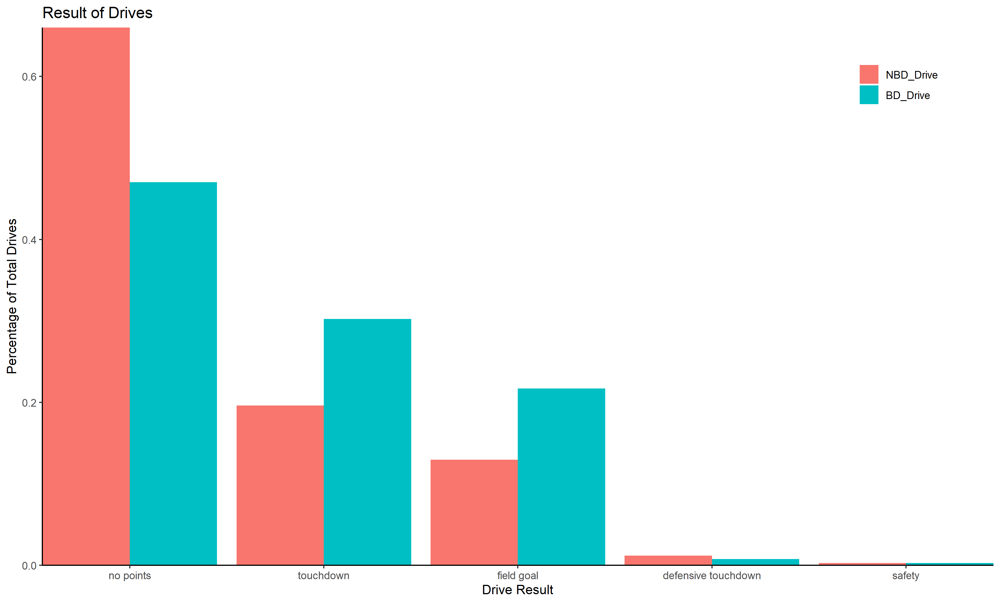
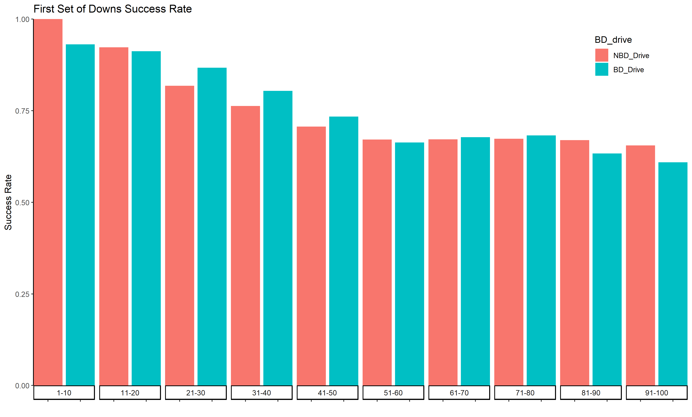
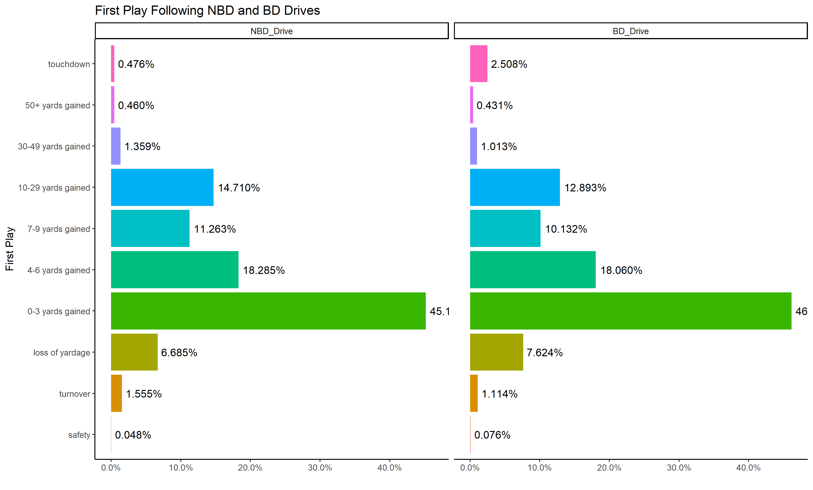

# NFL Pyschological Momentum Analysis

## Inspiration
This analysis of psychological momentum is inspired by the "Turning the Tide: Plays and Psychological Momentum in the NFL" paper presented at the 2012 MIT Sloan Sports Analytics Conference by Aaron W. Johnson, Alexander J. Stimpson, and Torin K. Clark.

## Purpose
I consume way too much sports and announcers talk about momentum impacting teams' performance all the time. I wanted to create some charts to better understand this phenomenon. As my skills increase (and once I'm graduated and actually have time/motivation for this), I will continue to analyze this further. Consider this a first of many attempts.

## Background
The concept of psychological momentum (PM) in football is prevalent. One doesn't need to watch American football for long before being introduced to the term 'momentum.' For example, a team scores a touchdown and suddenly 'has momentum' but then throw an interception on the next drive and has now 'lost the momentum' to the other team.But what is it, how does it affect football, and is it even real? These are questions this analysis seeks to understand. These big plays that produce 'momentum' definitely seem like they have the power to change the course of the game, but showing their impact on teams' future performance is difficult. This analysis uses NFL data from 1999-2019 to better understand the relationship between big defensive (BD) plays and the same team's ensuing offensive possession. I created a few charts that help flesh out this relationship; in the future, I'd like to go more in-depth as I continue to improve my data analysis and data science skills.

## Definitions
PM: psychological momentum; the positive energy and confidence gained from big plays that may or may not improve the play of teams.
BD: big defensive play; interceptions, fumble recoveries, touchdowns scored, etc. The claim is these big plays will help that team's offense perform better.
BD Drive: the first offensive drive of a team immediately after their defense makes a BD play. i.e., Team A's offensive drive after they intercept Team B.
NBD Drive: every other offensive drive that does not follow a BD play.

## Analysis
### Points on Drive

This first chart is eye opening. Drives following a BD play (BD_Drives) are significantly more successful than drives not following BD plays (NBD_Drives). BD drives result in no points significantly less often and have touchdowns or field goals scored over 50% more often. However, this may be misleading - after all, field position needs to be taken into account here. NBD drives overwhelmingly start 60-90 yards away from the endzone, as they are usually the result of a returned punt or kickoff. The starting field position of BD drives on the other hand are much more evenly dispersed throughout the field, so they often start closer to the endzone. I plan to improve this analysis by factoring in field position, which will give a more accurate understanding of what this data says.

### First Series Success

This chart shows NBD and BD drives much more evenly. BD drives certainly look to be more successful than NBD drives when they start 21-50 yards away from the endzone, but this effect is negated the farther away from the end zone that they start. This could suggest that the PM gained from a big defensive play is real but only short-lived. It is also worth noting that NBD drives that start 1-10 yards away from the endzone scored touchdowns 100% of the time. This data could be skewed, however; after all, for an NDB drive to start that close to the endzone, it is likely due to a long punt or kickoff return, which would supply similar PM as big defensive plays.

### First Play Success

When analyzing the first play of a drive, BD drives and NBD drives are very similar to each other. The only truly noticeable difference is that the first play of BD drives result in touchdowns 5x more often than the first play of NBD drives. This is very notable. One possible explanation is that coaches often like to take 'shot plays' following a turnover - this means that they run a low-percentage play designed to score a touchdown. If this is called much more often on BD drives than NBD drives, that could explain the difference. However, it is possible that following a big defensive play, offenses are simply better at scoring touchdowns due to PM. To further improve this analysis, I would analyze the change in play types called on the first play of BD and NBD drives. However, at some point when analyzing that deep, the sample size may become too small to draw real conclusions.

## Conclusion
Well, not to be anticlimactic, but this analysis is not yet in-depth enough to conclude anything. It definitely looks like BD plays may help offenses, but I need to explore the data some more. Instead of presenting a final version of this, I wanted to get a first version of it out there so that I can continue to refine it as my skills grow. If you're reading this (hi! thanks for doing that!) and you have any comments of how this can be improved, send them my way. Heck, even clone this repo and contribute if you want. But as of right now, I'm just trying to survive until graduation, so this is what I've got. Thanks for reading, friend :)